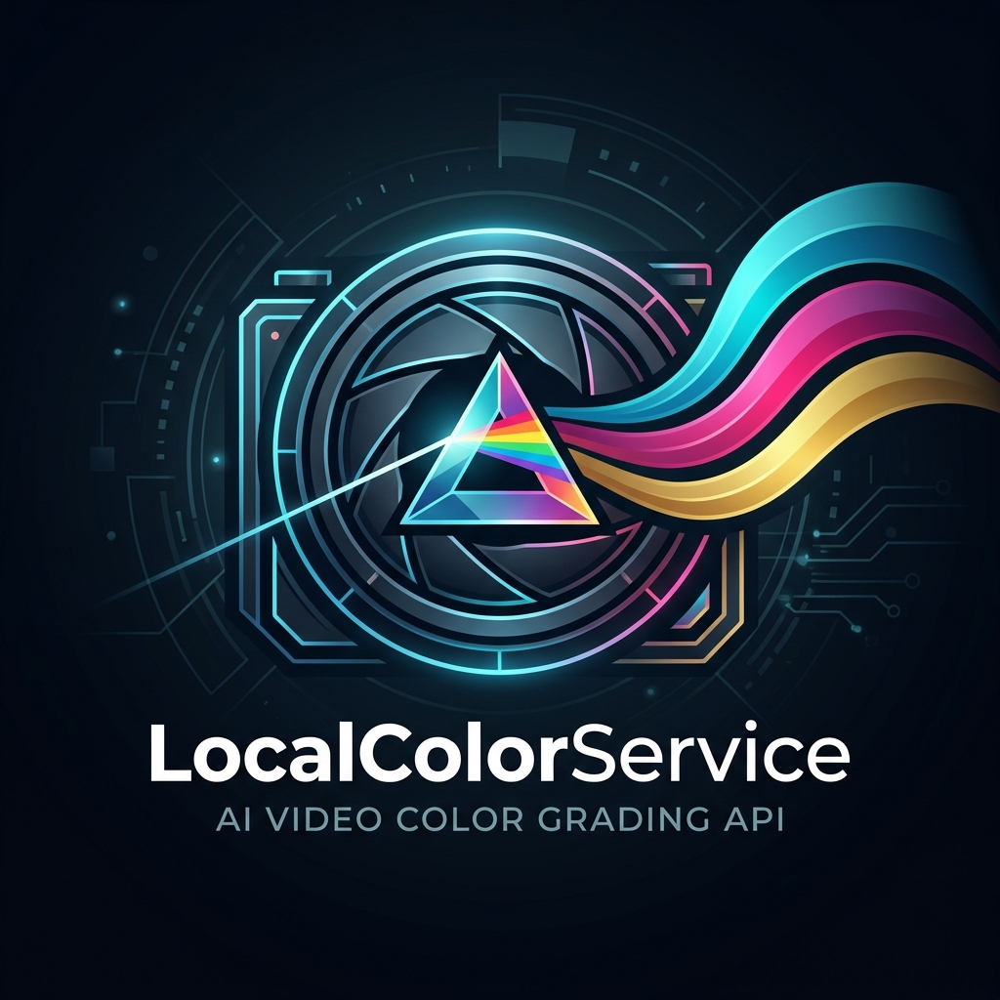
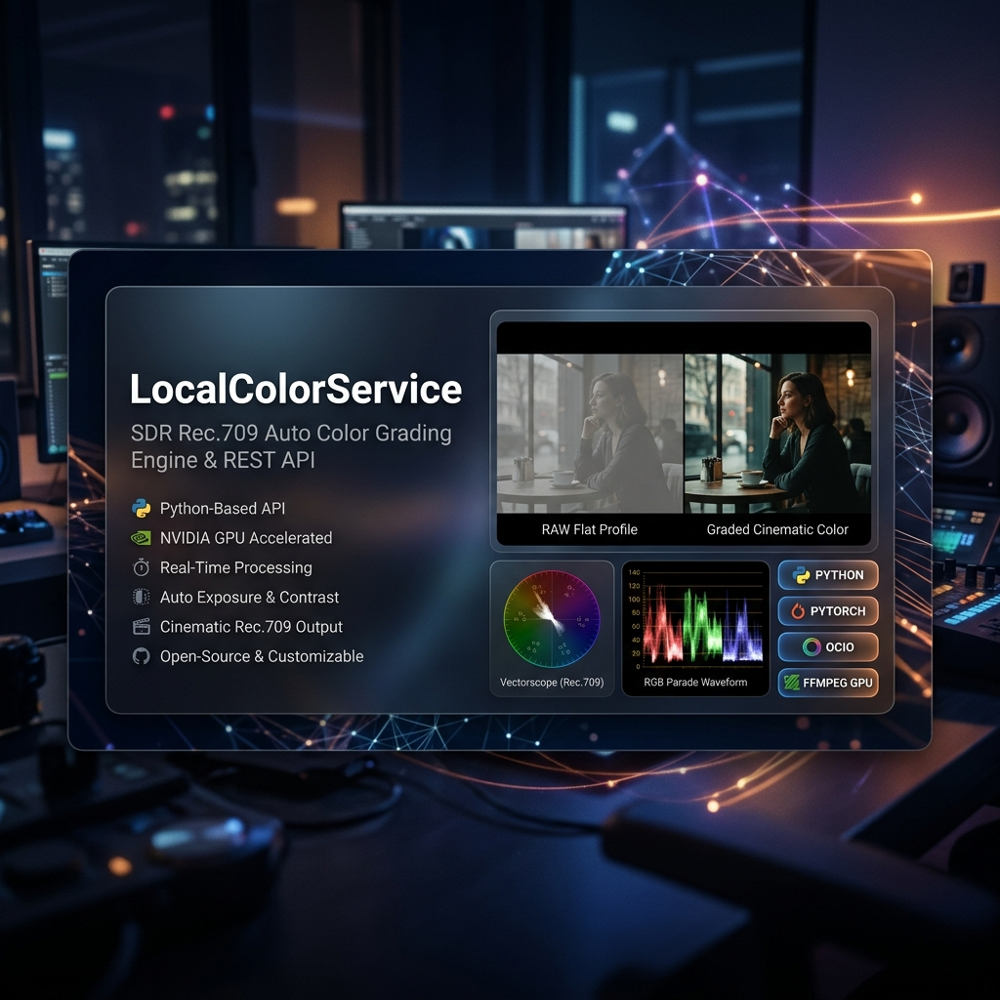
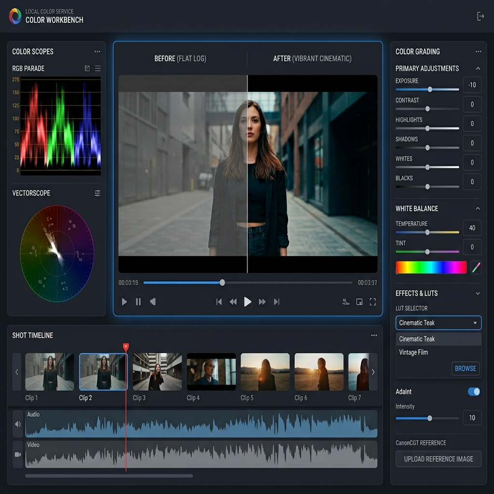

<div align="center">
  
  <h1>LocalColorService (v0.1.0)</h1>
  <p><strong>Open-Source SDR Rec.709 Auto Color Grading Engine & REST API Service</strong></p>

  [](LICENSE)
  [](pyproject.toml)
  [](CHANGELOG.md)
  [](app/main.py)
</div>

<br/>



**LocalColorService** is an open-source, high-performance SDR Rec.709 semi-automated video color grading engine and REST API service. It combines traditional broadcast color science, OpenColorIO (OCIO) color management, neural look transfer models (**AdaInt** and **CanonCGT**), face skin-tone protection, and automated 4-level Quality Control (QC).

---

## 🌟 Key Features

- **Automated Shot Analysis & Scene Grouping**:
  Integrates `PySceneDetect` for automatic shot boundary detection, multi-frame representative sampling, and grouping visually similar shots into `SceneGroups`.

- **Neural & Algorithmic Color Transfer**:
  - **AdaInt**: Direct inference of neural LUTs using official `AiLUT-FiveK-sRGB` checkpoints.
  - **CanonCGT**: Image-to-video reference color transfer for matching specific aesthetic target styles.
  - **Fallback Providers**: Reinhard color transfer & CLAHE adaptive color algorithms.

- **Selective Face Protection**:
  Automatically detects faces in video shots and applies time-smoothed skin-tone protection masks (`FACE_CREATIVE_STRENGTH`) to maintain natural skin appearance while applying aggressive creative LUTs.

- **OpenColorIO & Multi-Format LUT Export**:
  Generates OCIO `GroupTransform` nodes and bakes uniform 33³ and 65³ `.cube` LUTs, ASC-CDL `.cc/.ccc`, and ACES `.clf` files.

- **Revision Control & Asset Freezing**:
  Tracks GradePlan revisions with SHA-256 asset verification (`artifact_freeze.py`) and approval workflows, preventing accidental rendering of unapproved or outdated color plans.

- **4-Level Automated Quality Control (QC)**:
  Built-in checks for highlight/shadow clipping, color shift bounds, face mask integrity, and 3D LUT mathematical stability.

- **Multi-Lane Asynchronous Architecture**:
  Dual-worker processing (`heavy` rendering lane & `light` interactive lane) powered by FastAPI and background workers.

- **Web Workbench & Operational Dashboard**:
  Includes an out-of-the-box HTML5 Color Workbench UI (`/`) and Task Manager (`/tasks`).

---

## 🏗️ Architecture & Processing Pipeline

```text
[Input Video/Image Media]
         │
         ▼
 1. PySceneDetect Shot Splitting ──► Representative Frame Sampling
         │
         ▼
 2. Scene Grouping & Recipe Suggestion ──► (Neutral / Commercial / Cinematic / AdaInt / CanonCGT)
         │
         ▼
 3. GradePlan Editing & Face Protection ──► Selective Skin-Tone Masking
         │
         ▼
 4. OCIO GroupTransform & LUT Baker ──► Uniform 33/65³ CUBE / ASC-CDL / ACES CLF
         │
         ▼
 5. FFmpeg Timeline Render ──► Single-Pass Filter Complex Timeline Video Export
         │
         ▼
 6. Automated QC Validation ──► (Black/White Clipping, Shift, Mask & LUT Sanity Checks)
         │
         ▼
[Final Graded Video & Revision Metadata]
```

---

## 🚀 Quick Start

### 1. Requirements & Installation

- **OS**: Windows 11 / Linux (Ubuntu 22.04+)
- **Python**: `>= 3.10`
- **FFmpeg**: Built with GPU acceleration (NVDEC/NVENC recommended)

```bash
# Clone the repository
git clone https://github.com/your-org/LocalColorService.git
cd LocalColorService

# Install Python dependencies
pip install -r requirements.txt
```

### 2. Neural Model Setup (CanonCGT / AdaInt)

To enable neural reference color transfer, run the setup script:

```powershell
powershell -ExecutionPolicy Bypass -File scripts\install_canoncgt.ps1
```

### 3. Start the API Service

Run via Uvicorn:

```bash
python -m uvicorn app.main:app --host 127.0.0.1 --port 8000
```

- **Interactive Workbench**: `http://127.0.0.1:8000/`
- **Task Dashboard**: `http://127.0.0.1:8000/tasks`
- **OpenAPI Swagger Docs**: `http://127.0.0.1:8000/docs`

<br/>



---

## 🧪 System Diagnostics & Testing

Verify system dependencies (FFmpeg GPU support, PyTorch, OCIO, models):

```powershell
python scripts/doctor.py
```

Run the unit and integration test suite:

```powershell
python -m pytest -q
```

---

## 📡 REST API Reference Summary

All API endpoints follow standard REST conventions under the `/v1` prefix:

| Method | Endpoint | Description |
| :--- | :--- | :--- |
| `GET` | `/v1/health` | Service health status & GPU acceleration capabilities |
| `POST` | `/v1/color/analyze` | Split video into shots, extract representative frames & metrics |
| `POST` | `/v1/color/recipe` | Generate initial GradePlan recipes (Neutral, Commercial, Cinematic) |
| `POST` | `/v1/color/adaint-lut` | Infer AdaInt neural LUT for specified SceneGroup |
| `POST` | `/v1/color/canoncgt` | Reference image color matching and candidate LUT generation |
| `POST` | `/v1/color/preview` | Render timeline preview video (project or SceneGroup montage) |
| `POST` | `/v1/color/approve` | Approve GradePlan revision and freeze asset checksums |
| `POST` | `/v1/color/render` | Render final graded project video with QC report |
| `GET` | `/v1/jobs/{job_id}` | Query async job status and progress metrics |

For detailed request/response schemas, refer to the interactive [Swagger Documentation](http://127.0.0.1:8000/docs).

---

## 🤝 Open Source Community & Contributing

We welcome issues, feature suggestions, and Pull Requests!

- **Submit a Bug**: [.github/ISSUE_TEMPLATE/bug_report.yml](.github/ISSUE_TEMPLATE/bug_report.yml)
- **Request a Feature**: [.github/ISSUE_TEMPLATE/feature_request.yml](.github/ISSUE_TEMPLATE/feature_request.yml)
- **Contribution Guidelines**: See [CONTRIBUTING.md](CONTRIBUTING.md) for environment setup and PR workflows.
- **Code of Conduct**: Please follow our [Code of Conduct](CODE_OF_CONDUCT.md).

---

## 📄 License

This project is open-source software licensed under the **[MIT License](LICENSE)**.
